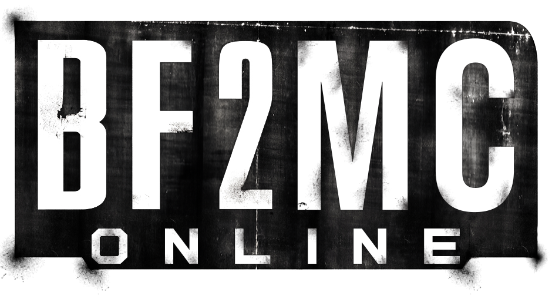

# Battlefield 2: Modern Combat Matchmaker Server

This project aims to revive the online matchmaking services for Battlefield 2: Modern Combat on PlayStation 2.

It enables players to create accounts and clans, add friends, and chat in-game. Additionally, we provide leaderboards for both players and clans. This project is essentially a recreation of the original GameSpy services, but with numerous enhancements and extra features.

We've also developed an API that allows third parties to access player, game, and clan data collected by our system.

We provide a documentation website about our project over [here](https://doc.bf2mc.com). You can find more details about all the source code we made.

Note: This project does not include the BF2MC-GameServer, which is required to host game servers. That is a separate project.

## DNS

To let this server work there are some DNS changes required before it all works.
The following domains needs to be redirected to this server:

	*.dnas.playstation.org
	*.easports.com
	*.gamespy.com

Read [here](dns/Readme.md) more about it how to install your own DNS.

## Apache server

To let the PS2 connect to our webservices we use apache2 as our proxy tunnel.

Read [here](apache2/readme.md) more about it how to install your own Apache server.

## Clone Project

```
git clone https://github.com/Project-Backstab/BF2MC-Matchmaker.git
cd BF2MC-Matchmaker

git submodule init
git submodule update

sudo apt-get install libmysqlclient-dev doxygen graphviz ccache
```

## Compile project

```
./make_release_build.sh
```
This will create the bf2mc executable and copy the data to the "BF2MC-Matchmaker-release" directory.

For development:
```
cd BF2MC-Matchmaker
mkdir build
cd build

cmake ..
cmake --build . --target doc
make -j 4
```

## Database

This project requires a mysql database to save/extract information.
Read [here](database/Readme.md) to setup. 

## Firewall

```
sudo ufw allow 80/tcp
sudo ufw allow 8080/tcp
sudo ufw allow 27900/udp
sudo ufw allow 28910/tcp
sudo ufw allow 29900/tcp
sudo ufw allow 29901/tcp
sudo ufw allow 29920/tcp
```

For MySQL:
```
sudo ufw allow from <myip> to any port 3306
```

## Run

For release:
```
cd BF2MC-Matchmaker-release/
./bin/bf2mc
```

For development:
```
cd BF2MC-Matchmaker/build
./bin/bf2mc
```

For development debugging:
```
cd BF2MC-Matchmaker/build
gdbserver --multi :2345 bin/bf2mc
```

## Services

If you want to run this project as a services you can read more about it over [here](service/Readme.md).