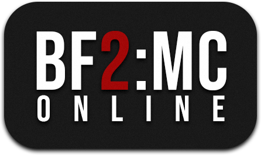

# Battlefield 2: Modern Combat Matchmaker server

This is a project to revive the online matchmaking services. This allows you to create a account and go online again. 
It also has the possebility to save your stats and communicate with other players.

## DNS

To let this server work there are some DNS changes required before it all works.
The following domains needs to be redirected to this server:

	www.easports.com
	bfmc.gamespy.com
	gpsp.gamespy.com
	gpcm.gamespy.com
	
Read [here](dns/Readme.md) more about about it.


## Clone/Compilation

```
git clone https://github.com/Project-Backstab/BF2MC-Matchmaker.git
git submodule init
git submodule update

sudo apt-get install libmysqlclient-dev

mkdir build
cd build
cmake ..
make

cmake --install . --prefix ../../BF2MC-Matchmaker-release
```

This will create the bf2mc executable.

## Database

This project requires a mysql database to save/extract information.
Read [here](database/Readme.md) to setup. 

## Run

```
cd BF2MC-Matchmaker-release/bin
sudo ./bf2mc
```

This will run 4 services on TCP port: 80, 28910, 29900 and 29901.
