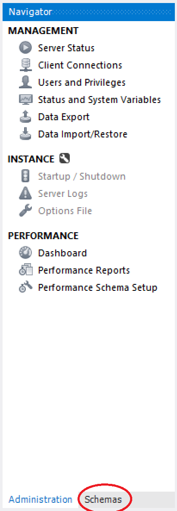

# Database

This project requires a Mysql server.

## Install

```
sudo apt install mysql-server
```

## Config

Run mysql secury script to configure to your liking
```
sudo mysql_secure_installation
```

In my case i allow to open up remote connections to admin the server.

## Remote control

I use [Mysql Workbench](https://www.mysql.com/products/workbench/) to remote control the database server.

### Connect

Use fill in your ip, port and username to connect to the database.


### Create schema

Once your logged in you can see your server stats. On the left bottom you will click tab Schema.



Then right click and create a new Schema.


